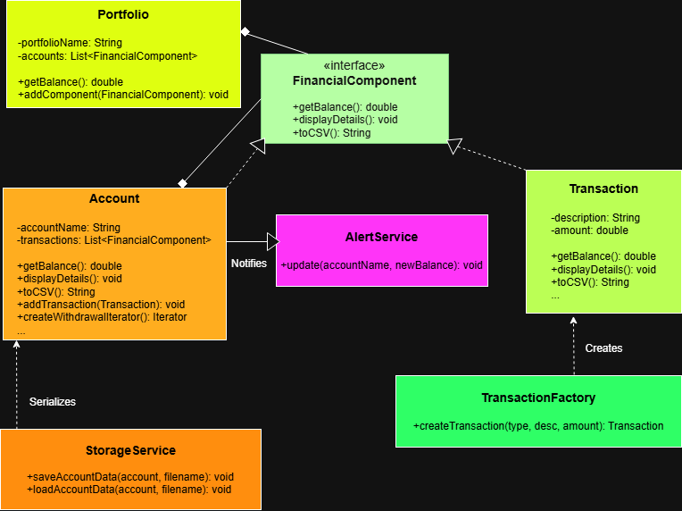

# Personal Financial Portfolio Manager

## Project Description
This application is a robust financial management tool designed to handle complex hierarchies of accounts and transactions. The goal of the project was to implement a system that is both secure and scalable, utilizing standard design patterns to manage data integrity and separate business logic from system services.

## Architecture & Design Patterns

### 1. Composite Pattern
The project uses the Composite pattern as its structural foundation. By defining a common `FinancialComponent` interface, the system treats individual **Transactions** (leaf nodes) and **Accounts** or **Portfolios** (composites) uniformly.
* **Rationale:** This allows the application to calculate balances recursively. The `Portfolio` can sum its total balance without needing to know if its children are individual accounts or sub-portfolios.

### 2. Factory Pattern
All financial objects are instantiated via the `TransactionFactory`.
* **Rationale:** This pattern centralizes object creation and input validation. It ensures that data is sanitized before it enters the system. If a user provides invalid numeric strings, the Factory intercepts the error and handles the translation into a domain-specific exception.

### 3. Observer Pattern
The `AlertService` acts as an observer to the `Account` class.
* **Rationale:** To maintain a "Separation of Concerns," the Account doesn't handle security alerts directly. It simply notifies registered observers of balance changes. This makes the system extensible, as new services (like logging or external notifications) can be added without modifying the core Account logic.

### 4. Iterator Pattern
The system implements a `CustomIterator` to handle transaction traversal.
* **Rationale:** This avoids exposing the internal collection of the Account. I implemented a specific iterator to filter "Withdrawals only," demonstrating how we can encapsulate specific traversal logic away from the main application flow.

### 5. Exception Shielding
* **Rationale:** Following security best practices, the application implements exception shielding. Low-level technical errors (like `IOException` or `NumberFormatException`) are caught, logged to a file, and wrapped in a friendly `ApplicationException`. This prevents technical stack traces from being exposed to the end-user.

---

## Technical Features
* **Java Stream API:** Used for high-level data processing and balance aggregations.
* **Data Persistence:** Implemented CSV-based serialization via a dedicated service layer.
* **Logging:** Integrated `java.util.logging` to record system events and errors with appropriate severity levels.
* **JUnit Testing:** Includes unit tests for the Factory and Serialization logic to ensure stability.

---

## How to Run the Application
1. **Compilation:** Use a standard Java compiler:
   `javac -d bin src/main/java/**/*.java`
2. **Execution:**
   `java -cp bin main.java.app.Main`
3. **Logs:** Technical details and errors can be reviewed in the `app.log` file generated in the project root.

---

## UML Reference
* **Interface:** `FinancialComponent`
* **Leaf Node:** `Transaction`
* **Composite Nodes:** `Account`, `Portfolio`
* **Subject:** `Account`
* **Observer:** `AlertService`

